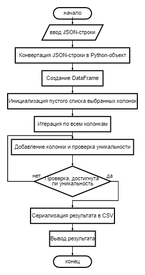

# Garpix: Задача на генерацию семантически значимого идентификатора

Этот проект анализирует JSON данные и находит минимальный набор признаков (атрибутов), которые однозначно идентифицируют каждую сущность.

## Структура проекта

- **app.py**: основной скрипт, содержащий алгоритм генерации идентификатора.
- **tests/unit_tests.py**: каталог с тестами для проверки работоспособности кода.
- **doc**: каталог, где хранится схема описания алгоритма.
- **data.json**: пример JSON-файла с данными.

## Описание алгоритма

### Блок-схема алгоритма

#### Назначение

Алгоритм предназначен для нахождения минимального набора признаков, которые однозначно идентифицируют каждую сущность в заданном наборе данных, представленных в формате JSON. Результат минимального набора признаков сохраняется в виде строки CSV и выводится на экран.

#### Описание шагов

1. **Начало**:
    - Начало выполнения алгоритма.

2. **Ввод JSON-строки**:
    - Ввод JSON-строки, содержащей данные.

3. **Конвертация JSON-строки в Python-объект**:
    - Преобразование JSON-строки в Python-объект (список словарей) с помощью `json.loads`.

4. **Создание DataFrame**:
    - Создание DataFrame из данных с помощью библиотеки pandas для удобной работы с данными.

5. **Инициализация пустого списка выбранных колонок**:
    - Создание пустого списка `selected_columns`, который будет хранить выбранные колонки.

6. **Поиск оптимального набора колонок (Цикл)**:
    - Итеративный процесс поиска колонок, которые обеспечивают уникальную идентификацию всех записей.
    - **Итерация по всем колонкам**:
        - Перебор всех колонок в данных.
    - **Добавление колонки и проверка уникальности**:
        - Добавление текущей колонки к уже выбранным и проверка, сколько уникальных записей получается.
    - **Проверка, достигнута ли уникальность**:
        - Проверка, достигнута ли уникальность для всех записей при текущем наборе колонок.
        - Если уникальность достигнута, выход из цикла.

7. **Сериализация результата в CSV**:
    - Преобразование списка выбранных колонок в DataFrame и затем в строку формата CSV с помощью `to_csv`.

8. **Вывод результата**:
    - Вывод результата на экран.

9. **Конец**:
    - Конец выполнения алгоритма.

